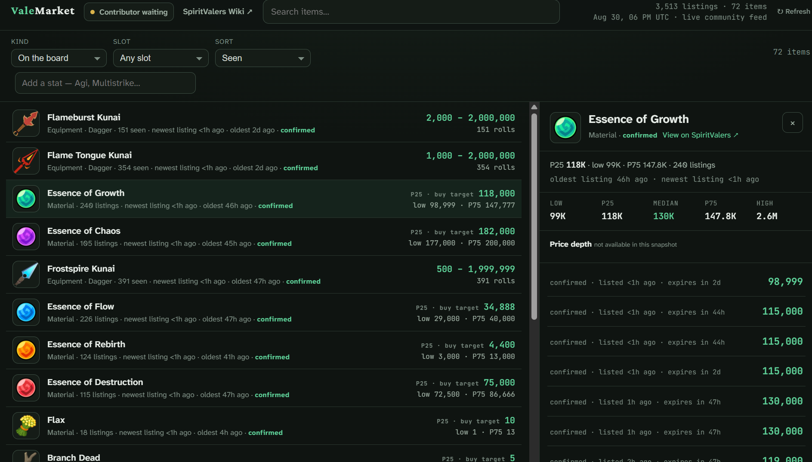

# ValeMarket Desktop

A Windows desktop market browser and passive community contributor for **Spirit Vale**.

ValeMarket shows currently active listings reported by contributors. It is not a sale-history tracker, does not automate the game, and does not modify game files.



- Browse the live market at [market.spiritvalers.com](https://market.spiritvalers.com/)
- Integrate with the [public market API](https://market.spiritvalers.com/api/)
- Download the latest Windows build from [Releases](https://github.com/bjb2/valemarket-desktop/releases/latest)
- Report bugs through [GitHub Issues](https://github.com/bjb2/valemarket-desktop/issues)

## Install

### Requirements

- Windows 10 or 11, x64
- [Npcap](https://npcap.com/#download)
- Spirit Vale

### Steps

1. Download `ValeMarket-Desktop-v<version>-windows-x64.zip` from the latest release.
2. Extract the entire archive to a folder you can keep.
3. Run `valemarket-desktop-win_x64.exe` from that folder.

Keep the executable, `resources.neu`, `neutralino.config.json`, and `extensions` directory together. ValeMarket stores its settings and contributor identity in the extracted folder.

The initial build is unsigned, so Windows may show an unknown-publisher warning. Verify that the download came from this repository and compare its SHA-256 checksum with the release notes.

## Market refresh

ValeMarket loads one complete public snapshot generated every 15 minutes. Visitors download the prebuilt snapshot instead of issuing paginated database queries.

- Select **Refresh** in the header to check the current edge snapshot.
- The desktop app refreshes automatically every 30 minutes while visible.
- Returning to a window that has been in the background for at least 30 minutes also refreshes it.
- Search text, filters, sorting, and the selected item remain in place across a refresh.

The displayed timestamp comes from the API snapshot. Expired listings are filtered again in the client and never shown, even if they expired during the cache window.

## Passive contribution

Contribution is enabled by default. Open **Contributor** in the header to turn it off or select a capture adapter.

When Npcap is available, ValeMarket observes Spirit Vale market traffic locally and uploads normalized listing observations to the community API. New contributors are eligible immediately; a single eligible contributor is sufficient for the launch policy.

ValeMarket reassembles fragmented LiteNetLib messages before FishNet decoding, including large market result pages. Starting ValeMarket before Spirit Vale preserves the full session setup. If the Contributor panel reports unresolved linked responses, copy the diagnostic state and report it; the spawn, registration, and session-link counters contain no packet payload or account data. If it reports incomplete fragmented messages, select the adapter carrying Spirit Vale traffic directly.

Uploads include the listing price, quantity, status, displayed stats, and visible refine, potential, card, gem, and gem-refine metadata.

ValeMarket does **not** upload:

- raw network packets
- account or character identifiers
- seller or buyer identities
- installation paths
- unrelated application traffic

If another tool already contributes to ValeMarket, enable contribution in only one application.

## Development

The app uses [Neutralinojs](https://neutralino.js.org/) for the desktop shell, [Bun](https://bun.sh/) for the local backend, and Npcap for process-scoped packet capture.

### Prerequisites

- Windows x64
- Bun 1.4 or newer
- Npcap

### Build from source

```powershell
git clone https://github.com/bjb2/valemarket-desktop.git
cd valemarket-desktop
bun run setup
bun run check
bun run package
```

The Windows release archive is written to:

```text
dist/ValeMarket-Desktop-v<version>-windows-x64.zip
```

### Useful commands

```text
bun run dev       Prepare and launch a development build
bun run check     Run TypeScript checks and tests
bun run package   Build the Windows release archive
```

## Project layout

```text
src/backend/      Npcap lifecycle, local API, and contribution pipeline
src/frontend/     Market browser and contributor controls
src/shared/       Shared desktop contracts
assets/           Local catalog, fonts, icons, and application artwork
test/             Contributor behavior tests
```

The public market API is operated separately at [market-api.spiritvalers.com](https://market.spiritvalers.com/api/). Its Cloudflare infrastructure, database, and deployment configuration are maintained in a private repository.
